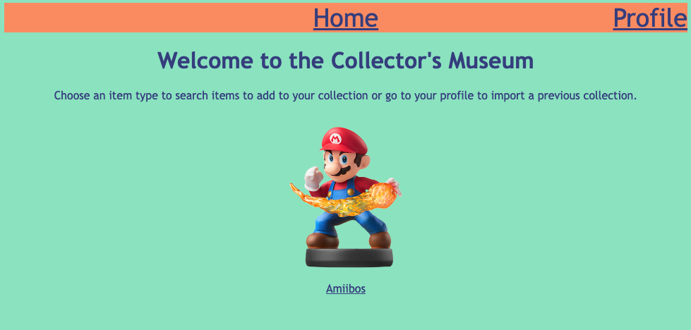
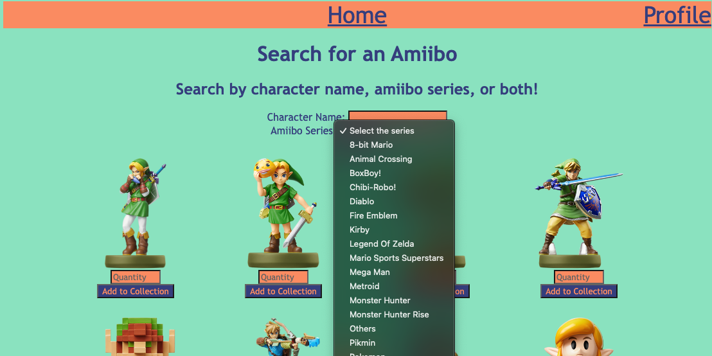
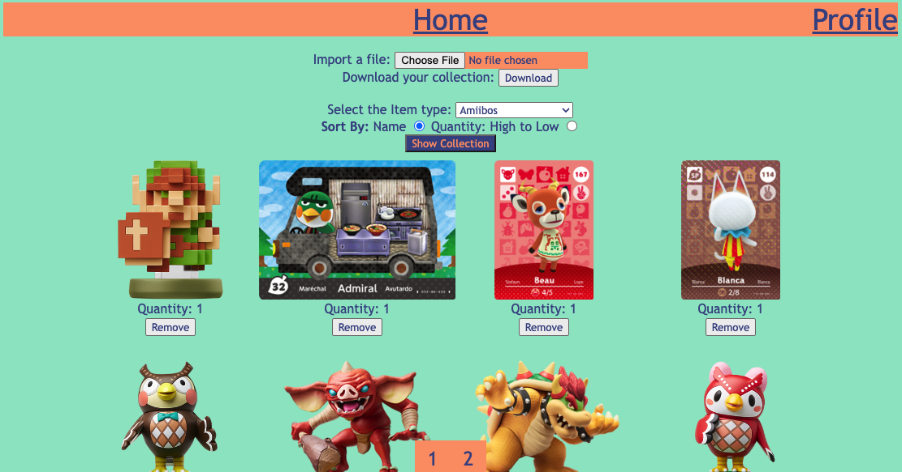
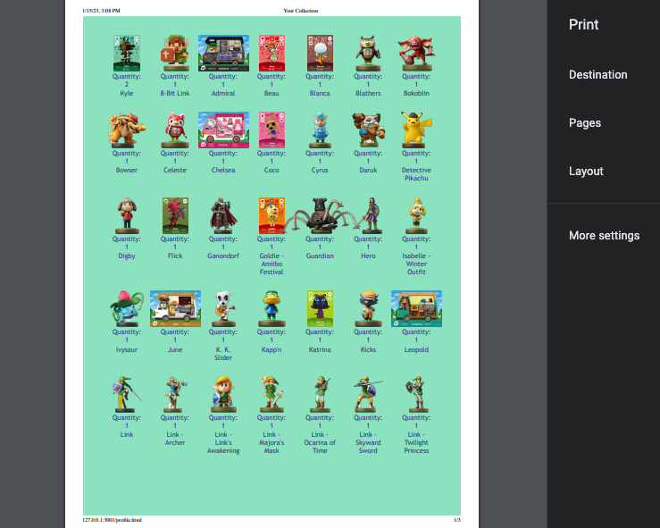

# Collectors Museum
A place where fellow collectors can keep track of their most prized possessions all in one place.
 
[Go to your Museum](https://collectors-museum.netlify.app/)

---
# Features
## Choose an item type
Choose which type of item you collect to start searching. Currently, you add amiibos to your collection.

---

## Search 
Search for any item you are looking to add.

## View and Save Your Collection
Go to your profile to view each of your collections. Download your collection file or import a previous collection to update it.

---

## Print your Collection
Your collection will be specially formatted in case you want to have a physical copy.

---

# Planned Features
1. Create Logo
2. Add more collection item types
   - Pop figures
   - Yugioh Cards
   - Pokemon Card
   - Magic Cards
   - Manga
   - etc., taking suggestions
3. Let user to update quantities from the profile page
4. Let user see current quantities of shown on search screen
5. Improve visual appeal
6. A login feature, to no longer require downloading file to save collection (requires server)

---

# APIs Used

<table>
<thead>
	<tr>
		<th><a  href="https://amiiboapi.com/" >Amiibo API</a> </th>
        <th> </th>
	</tr>
</thead>
<tbody>
	<tr>
		<td></td>
		<td>
	</tr>
</tbody>
</table>
